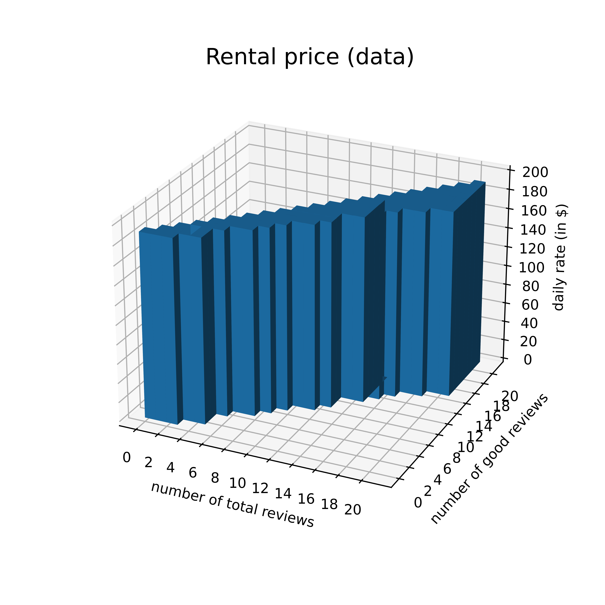

# Replication code

## Dataset Preparation

<ul>
  <li>Read in <code>MSA_new-york-newark-jersey-city-ny-nj-pa_Property_Extended_Match_2021-11-19.csv</code> (data on properties) </li>
  <li>Restrict properties to entire homes in Manhattan with exactly 1 bedroom, 1 bathroom, at most 2 guests, at least 1 photo, no pets allowed.</li>
  <li>Read in <code>MSA_new-york-newark-jersey-city-ny-nj-pa_Daily_Match_2021-11-19.csv</code> (daily booking data) for these properties. </li>
  <li>Read in <code>New_York-Newark_Property_Trajectory.csv</code> (~bi-monthly ratings data) and merge with daily bookings data. </li>
  <li>Restrict observation period to 01/01/2016 to 31/12/2019 (4y).</li>
  <li>If the number of reviews $N$ is missing for a id-day, fill in the last observed $N$ of the same property.</li>
  <li>If $N$ for a id-day is missing and N has been observe prior, fill in the first observed $N$ of the same property.</li>
  <li>If $N$ is still missing, set $N$ equal to zero.</li>
  <li>Replace zero ratings, with missings and multiply average ratings less or equal to 10 by 10 (coding errors).</li>
  <li>If the rating $r$ is missing for a id-day, fill in the last observed $r$ of the same property.</li>
  <li>If the $r$ is missing for a id-day and no $r$ has been observe prior, fill in the first observed $r$ of the same property.</li>
  <li>If the cleaning fee is missing for a id-day, fill in the last observed cleaning fee of the same property.</li>
  <li>If the cleaning fee for a id-day is missing and cleaning fee has been observe prior, fill in the first observed cleaning fee of the same property.</li>
  <li>If the cleaning fee is still missing or zero, set it to the average across properties.</li>
  <li>Drop all id-days that are anything else but reserved ($B=1$) or available ($B=0$).</li> 
  <li>Drop properties that are never booked during their lifetime.</li>
  <li>Drop properties if their daily rate $p$ is ever at or above the 99 percentile or below the 1 percentile.</li>
  <li>Compute <i>gross</i> daily rates as $$P = p + \frac{\text{cleaning fee}}{\text{avg booking length}}.$$</li>
  <li>Cap $N$ at 20. Define the number of good reviews as $$K = \frac{1}{4}(r-1)N.$$</li>
  <li>Preliminarily define state $x$ as $(N,K)$.</li>
  <li>Load dataset into R and run the regression $B = aP + \sum b(x) + \sum b(\tau) + \sum b(j) + e$, where $b(x)$, $b(\tau)$ and $b(j)$ are state, week-year and id dummies respectively </li>
  <li> Types $t\in\{1,2,3,4\}$ are defined based on which quartile $b(j)$ falls into. </li>
</ul>

| type | avg price | avg reviews | avg booking prob | avg rating |
| ---: | ---: | ---------: | ------: | ------: |
| 1 | \$198.97 | 8.09 | 11.22% | 4.33 stars |
| 2 | \$218.30 | 7.60 | 29.48% | 4.32 stars |
| 3 | \$193.54 | 11.71 | 64.14% | 4.57 stars |
| 4 | \$188.83 | 9.65 | 83.56% | 4.57 stars |

## Demand Estimation

<ul>
  <li> On average, there are 635.03 bookings per day. Assuming there are 20,000 consumers every day, Airbnb's market share is 3.17%.  </li>
  <li> Defining a 'month' as a 4 week interval, aggregate the daily data to the month level. </li>
  <li> A property's market share is $s = \frac{B}{mu}$. </li>
  <li> The share of the outside good is $s_0 = 1- \sum s$. </li>
  <li> A property's market share <i>within</i> a certain type is $s_{t} = \frac{B}{\sum_{t}B_t}$. </li>
  <li> Drop month-ids if the market share is zero. 63.04% of the original dataset remain. </li>
  <li> Use GMM to estimate $$\ln(s) - \ln(s_0) = \gamma\frac{\text{expit}(\psi)\exp(\iota) + K}{\exp(\iota) + N} + 1.146\alpha P + \sum b(t) + \xi. $$ </li>
  <li> The moment conditions are $ \xi Z $, where $Z$ includes $N,K,KN,P,t_1,t_2,t_3,t_4$. </li>
</ul>

| coef | estimate | std err | sign |
| ---: | ---: | ---------: | ------: |
| $\psi$ | -0.263 | (0.1630) |  |
| $\iota$ | 1.372 | (0.1311) | *** |
| $\alpha$ | -0.001 | (0.0000) | *** |
| $\beta_1$ | -11.170 | (0.0520) | *** |
| $\beta_2$ | -10.860 | (0.0516) | *** |
| $\beta_3$ | -10.579 | (0.0518) | *** |
| $\beta_4$ | -10.333 | (0.0044) | *** |
| $\gamma$ | 0.764 | (0.0610) | *** |

<ul>
  <li> $\alpha$ is most likely biased because it is correlated with the unobserved quality of a property. </li>
  <li> To address this, define instrument $z_p$ as the <i>average booking length</i> in days; whether a property tends to be booked short- or long-term should not have a direct effect on the <i>probability</i> that it is booked. However, the marginal cost of providing the Airbnb presumably decreases in the number of days the guest stays at the property (notably the host has to be physically present on the first day). Thus, the reservation length reflects the marginal cost (and, as the marginal cost is partially passed on to guests, is correlated with the rental rate) but does not relate to a property's unobserved quality. </li>
  <li> In addition, $\iota$, $\psi$ and $\gamma$ are likely biased because $N$ and $K$ are correlated with a property's unobserved quality. </li>
  <li> We use the de-meaned occupancy rate 6-month prior ($z_n$) and the star rating of a property to instrument the number of reviews. </li>
</ul>

| | count | mean | std | min | 25% | 50% | 75% | max |
| ---: | ---: | ---: | ---: | ---: | ---: | ---: | ---: | ---: |
| $z_p$ | 112595 | 6.9125 |5.9358 | 1.0000 | 4.3333 | 5.7321 |7.8519 | 274.0000 |
| $z_n$ | 112595 | 6.9125 |5.9358 | 1.0000 | 4.3333 | 5.7321 |7.8519 | 274.0000 |
<ul>
  <li> Because of the lagged variable only a third of the original dataset survives. </li>
  <li> The estimated prior is 4.38 stars. The average rating in the data is 4.44 stars. </li>
  <li> The estimated average own-price elasticity of demand is $-XXX$. </li>
</ul>

| coef | estimate | std err | sign | estimate | std err | sign |
| ---: | ---: | ---------: | ------: | ---: | ---: | ---------: |
| $\psi$ | -0.263 | (0.1630) |  | 1.990 | (0.073) | *** | 1.688 | (0.8037) | * |
| $\iota$ | 1.372 | (0.1311) | *** | 2.844 | (0.4628) | ** | 2.245 | (1.5429) | ** |
| $\alpha$ | -0.001 | (0.0000) | *** | -0.010 | (0.0008) | *** | -0.011 | (0.0029) | *** |
| $\beta_1$ | -11.170 | (0.0520) | *** | -14.231 | (1.4509) | *** | -11.817 | (3.4903) | *** |
| $\beta_2$ | -10.860 | (0.0516) | *** | -13.823 | (1.4501) | *** | -11.414 | (3.4948) | *** |
| $\beta_3$ | -10.579 | (0.0518) | *** | -13.682 | (1.4521) | *** | -11.265 | (3.4870) | *** |
| $\beta_4$ | -10.333 | (0.0044) | *** | -13.478 | (1.4517) | *** | -11.059 | (3.4892) | *** |
| $\gamma$ | 0.764 | (0.0610) | *** | 6.383 | (1.6839) | *** | 3.790 | (3.7575) |  |

<ul>
  <li> For the supply estimation, we define a booking unit as a week. Hence, we aggregate the data to the weekly level. This is motivated by the fact that average reservation length (in the estimation sample) is close to 7 days.  </li>
  <li> The weekly occupancy rate is $1-exp(-mu\times s)\in[0,1]$. The probability that a booking results in a rating is the $\Delta N / \Delta B$ for the observation period or 22.59%.  </li>
  <li> We estimate the two mean entry cost and mean scrap value by maximizing the likelihood of the state distribution in our data sample. </li>
</ul>

 

## Summary

|  | name |            |  value |
| ---: | ---: | ---------: | ------: |
| demand | price | $\alpha$ | -0.010 |
|| constant | $\beta_1$ | -11.817 |
|| mid-scale | $\beta_2$ | -11.414 |
|| up-scale | $\beta_3$ | -11.265 |
|| luxury | $\beta_4$ | -11.059 |
|| quality | $\gamma$ | 3.790 |
|| prior | $a$ | 7.969 |
||  | $b$ | 1.473 |
| supply | mean entry cost | $\bar \kappa$ | 64,428 (~22% of avg $PDV) |
|| mean scrap value | $\bar \phi$ | 373302 (~11706% of avg $PDV) |
| other | discount factor | $\delta$ | 0.995 |
|  | revenue fee | $f$ | 0.142 |
|  | arrival rate | $\mu$ | 20,000 |
|  | review prob. | $\upsilon_r$ | 0.2257 |
|  | max. no. of reviews | $\bar N$ | 20 |
|  | max. no. of listings | $J$ | 2,000 |
