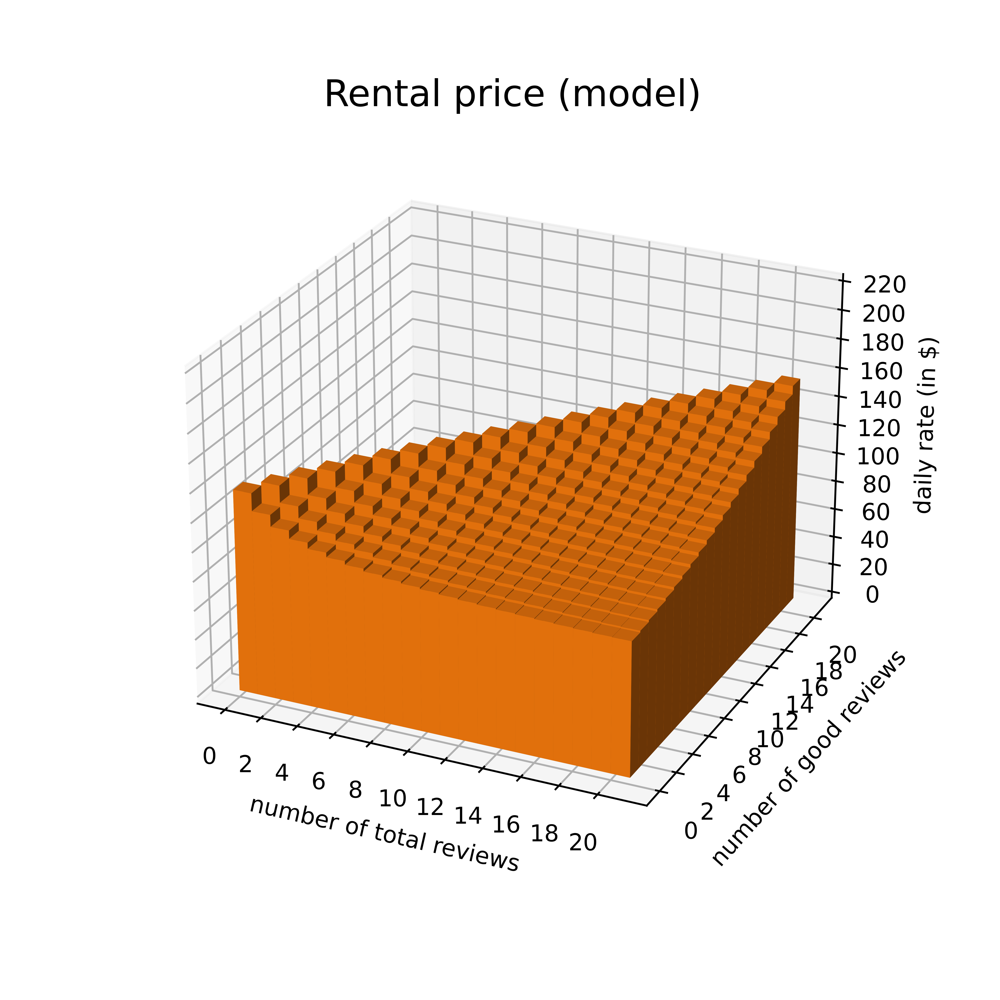
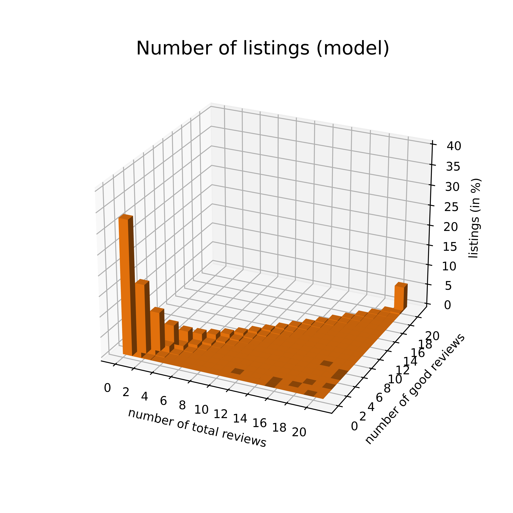
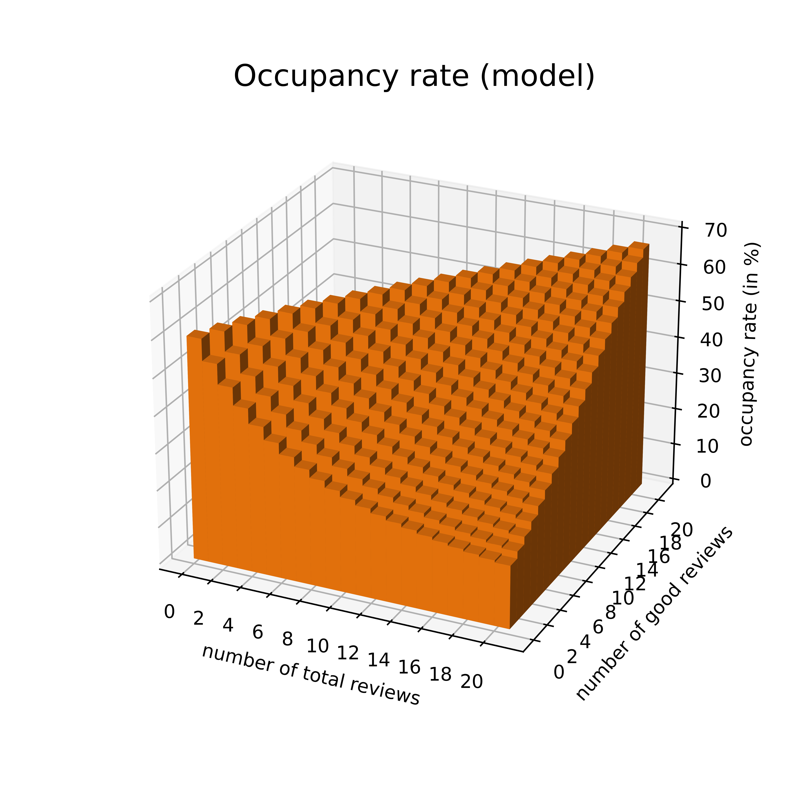

# Replication code

## Parameter

|  | name |            |  value |
  | ---: | ---: | :---------: | :------: |
  | demand (<code>theta</code>) | price | $\alpha$ | -0.0068 |
  || type 1 | $\beta_1$ | -12.5906 |
  || type 2 | $\beta_2$ | -12.1095 |
  || type 3 | $\beta_3$ | -11.7011 |
  || type 4 | $\beta_4$ | -11.3012 |
  || quality | $\gamma$ | 4.8860 |
  || prior | $a$ | 12.2260 |
  ||  | $b$ | 2.1134 |
  | supply (<code>c</code>) | mean entry cost (type 1) | $\bar \kappa_1$ | 55,496 |
  |  | mean entry cost (type 2) | $\bar \kappa_2$ | 96,673 |
  |  | mean entry cost (type 3) | $\bar \kappa_3$ | 161,946 |
  |  | mean entry cost (type 4) | $\bar \kappa_4$ | 270,233 |
  || mean fixed cost (type 1) | $\bar \phi_1$ | 2,580 |
  | | mean fixed cost (type 2) | $\bar \phi_2$ | 3,577 |
  || mean fixed cost (type 3) | $\bar \phi_3$ | 4,562 |
  || mean fixed cost (type 4) | $\bar \phi_4$ | 5,751 |
  | other (<code>params</code>) | discount factor | $\delta$ | 0.995 |
  |  | revenue fee | $f$ | 0.142 |
  |  | review prob. | $\upsilon_r$ | 0.7041 |
  |  | max. no. of reviews | $\bar N$ | 20 |
  |  | arrival rate | $\mu$ | 10,000 |
  |  | max. no. of listings | $J$ | 10,000 |

## Demand

Function <code>U_s(p,theta,t,params)</code> characterizes a guests's indirect **utility** of renting a property in state $x=(N,K,j)$, where $j = ${1,2,3,4} is the property's (observed) **type**.

  $$U_x = \gamma\frac{a + K(x)}{a + b + N(x)} + \beta(x) + \alpha ((1+f)p- t) + \epsilon = u(p,x) + \epsilon$$
  
$p$ is the daily rental rate of the listing; $t$ is the counterfactual per-unit subsidy. For the moment, we set $t$ equal to zero.

The **unobserved quality** $\omega$ is unknown to guests and hosts. However, $\omega$ is known to be iid $Beta(a,b)$ distributed. After observing the number of good reviews $K$ and bad reviews $N-K$ agents form an expectation about the unobserved quality, $E[\omega|N,K]$.</li>

$\epsilon$ is iid T1EV extreme value distributed.

$\mathbf{s}$ is the **state distribution**. $s(x)$ pins down the number of properties in each state. Function <code>ccp_s(p,P,s,theta,t,params)</code> characterizes the probability that a guest ***intends*** to book the property at rate $p$ provided that all remaining hosts set their prices according to $P(x)$.

$$ccp(p,x) = \frac{\exp(u(p,x))}{1+\sum_xs(x)\exp(u(P(x),x))}$$ For later use, we also work out the first-order (<code>dccp_s(p,P,s,theta,t,params)</code>) and second-order (<code>d2ccp_s(p,P,s,theta,t,params)</code>) derivatives of $ccp(p,x)$ with respect to $p$.

$$ccp'(p,x) = ccp(p,x)(1 - ccp(p,x))\alpha(1+f) $$

$$ccp''(p,x) = ccp(p,x)(ccp(p,x)^2 - ccp(p,x))\alpha^2(1+f)^2 $$

The number of arriving guests is $Poisson(\mu)$ distributed. Function <code>q_s(p,P,s,theta,t,params)</code> characterizes the probability that at least one of these consumers books the property, again assuming its rental rate is $p$ while everyone else follows the pricing rule $P(x)$.

$$q(p,x) = 1 - \exp(-\mu \cdot ccp(p,x))$$

Function <code>dq_s(p,P,s,theta,t,params)</code> and function <code>d2q_s(p,P,s,theta,t,params)</code> describe the first- and second-order derivatives of $q(p,x)$ with respect to $p$.

  $$q'(p,x) = \mu\exp(-\mu \cdot ccp(p,x))ccp'(p,x)$$
  
  $$q''(p,x) = \mu\exp(-\mu \cdot ccp(p,x))(ccp''(p,x)-\mu\cdot ccp'(p,x))$$

Strictly speaking, $q_s$ is the ***daily*** booking probability. As a **time period** in the model is a 4-week interval ("month"), we interpret $q_s$ as the monthly **occupancy rate**. 

## State Transitions

If a property is booked ($q(p,x) = 1$), $x$ changes with probability $\upsilon_r = 70.41$% between periods. Conditional on being booked, it receives a good review ($\Delta N = 1, \Delta K = 1$) with probability $\frac{a+K(x)}{a+b+N(x)}$. Conditional on being booked, it receives a bad review ($\Delta N = 1, \Delta K = 0$) with probability $\left(1-\frac{a + K(x)}{a+b+N(x)}\right)$. The **probability of getting a good review**  and the **probability of getting a bad review** are $\rho^g(p,x)$ and $\rho^b(p,x)$ respectively. States where $N=20$ are **terminal** and the probability of getting a review is zero.

$$\rho^g(p,x) = \upsilon_rq(p,x)\frac{a+K(x)}{a+b+N(x)}$$

$$\rho^b(p,x) = \upsilon_rq(p,x)\left(1-\frac{a + K(x)}{a+b+N(x)}\right)$$

Accordingly, the probability $\rho^0(p,x)$ of getting no review is $1-\rho^g(p,x)-\rho^b(p,x)$. States are arranged in increasing order of type $j$ and, for a given type, in increasing order of $N$ and, for a given $N$, in increasing order of $K$. $S$ is the **state space**. Note: $S$ is in <code>params</code>.

$$ S = \begin{bmatrix} 
1 & 0 & 0 & 0 & 0 & 0 \\ 
1 & 0 & 1 & 0 & 0 & 0 \\
2 & 1 & 1 & 0 & 0 & 0 \\
2 & 0 & 2 & 0 & 0 & 0 \\
2 & 1 & 2 & 0 & 0 & 0 \\
3 & 2 & 2 & 0 & 0 & 0 \\
... & ... & ... & ... & ... & ... \\ 
11 & 17 & 0 & 0 & 1 & 0 \\
12 & 17 & 0 & 0 & 1 & 0 \\
13 & 17 & 0 & 0 & 1 & 0 \\
... & ... & ... & ... & ... & ... \\ 
19 & 20 & 0 & 0 & 0 & 1 \\
20 & 20 & 0 & 0 & 0 & 1
\end{bmatrix} $$

Function  <code>dT_s(dq,theta,params)</code> stores the **transition matrix** $\mathbf{T}(p)$. It turns out that the way states are ordered the number of zeros between $\rho^0(p,x)$ and $\rho^g(p,x)$ is $N$.  

|  | $(0,0,1)$ | $(0,1,1)$ | $(1,1,1)$ | $(0,2,1)$ | $(1,2,1)$ | $(2,2,1)$ | ... | $(20,20,4)$ | 
| :---: | :---: | :---------: | :------: | :------: | :------: | :------: | :------: | :------: |
| $(0,0,1)$ | $\rho^0_{(0,0,1)}$ | $\rho^g_{(0,0,1)}$ | $\rho^b_{(0,0,1)}$ | 0 | 0 | 0 | ... | 0 |
| $(0,1,1)$ | 0 | $\rho^0_{(0,1,1)}$ | 0 | $\rho^g_{(0,1,1)}$ | $\rho^b_{(0,1,1)}$ | 0 | ... | 0 |
| $(1,1,1)$ | 0 | 0 | $\rho^0_{(1,1,1)}$ | 0 | $\rho^g_{(1,1,1)}$ | $\rho^b_{(1,1,1)}$ | ... | 0 |
| $(0,2,1)$ | 0 | 0 | 0 | $\rho^0_{(0,2,1)}$ | 0 | 0 | ... | 0 |
| $(1,2,1)$ | 0 | 0 | 0 | 0 | $\rho^0_{(1,2,1)}$ | 0 | ... | 0 |
| $(2,2,1)$ | 0 | 0 | 0 | 0 | 0 | $\rho^0_{(2,2,1)}$ | ... | 0 |
| ... | ... | ... | ... | ... | ... | ... | ... | 0 |
| $(20,20,4)$ | 0 | 0 | 0 | 0 | 0 | 0 | ... | 1 |

Function <code>dT_s(q,theta,params)</code> and <code>d2T_s(q,theta,params)</code> store the first-order and second-order derivatives of $\mathbf{T}(p)$ respectively. Notice:

$$\rho^{0\prime}(p,x) = -\upsilon_rq'(p,x)$$

$$\rho^{0\prime\prime}(p,x) = -\upsilon_rq''(p,x)$$

$$\rho^{g\prime}(p,x) = \upsilon_rq'(p,x)\left(\frac{a+K(x)}{a+b+N(x)}\right)$$

$$\rho^{g\prime\prime}(p,x) = \upsilon_rq''(p,x)\left(\frac{a+K(x)}{a+b+N(x)}\right)$$

$$\rho^{b\prime}(p,x) = \upsilon_rq'(p,x)\left(1-\frac{a+K(x)}{a+b+N(x)}\right)$$

$$\rho^{b\prime\prime}(p,x) = \upsilon_rq''(p,x)\left(1-\frac{a+K(x)}{a+b+N(x)}\right)$$

## Market Entry & Exit

Types are equally distributed in the host population, meaning 2,500 properties have a certain type. If a host is **inactive** and has not yet entered the market, they can do so at the start of the following month at **entry cost** $\kappa$ which is iid drawn from $Exponential(\bar \kappa_j)$, $j=${1,2,3,4}. Let $\lambda_j$ denote the **entry rate**. 

$$ \lambda_j = 1-\exp(-\delta V((0,0,j))]\bar\kappa_j^{-1} ) $$

Denote the number of properties of type $j$ by $s_j$. The expected, total entry costs of type-$j$ hosts in a given month is the number of inactive hosts $(J/4 - s_j)$ times $\mathbb{E}[\kappa_j|\phi_j\geq \delta V(0,0,j)]$.

$$ \text{Total entry costs} = \sum_{j}(J/4 - s_j)\left(\lambda_j\bar \kappa_j - (1-\lambda_j)\delta V((0,0,j))\right) $$

If a host is **active** they have entered the market. At the end of each month they have to pay the **operating cost** $\phi_j$ for the following month, regardless of whether the property is booked or not. $\phi_j$ is iid $Exponential(\bar \phi_j)$ distributed. Let $\chi(p,x)$ denote the **exit rate**.

$$ \chi(p,x) = \exp(-\delta \mathbb{E}_{\tilde x}[V(\tilde x)|p,x]\bar\phi_j^{-1} ). $$

$\tilde x$ denotes the state in the next month. Note that the host's expectation depends on $p$ because the property is likely to transition to a new state if it is booked.  

The expected, total operating costs of properties in a certain state in a given month are the number of active hosts $s(x)$ times $\mathbb{E}[\phi(x)|\phi(x)\leq \delta \mathbb{E}_{\tilde x}[V(\tilde x)|p,x]]$ 

$$ \text{Total operating costs} = \sum_{x}s(x)\left((1-\chi(p,x))\bar \kappa(x) - \chi(p,x)\delta \mathbb{E}_{\tilde x}[V(\tilde x)|p,x]\right) $$ 

<code>F_s(p,P,s,q,chi,lamb,theta,t,params)</code> contains the **expanded transition matrix** $\mathbf{F}(p)$. It accommodate transitions from and to inactivity by expanding $\mathbf{T}(p)$ by an additional state.

|  | $(0,0,1)$ | $(0,1,1)$ | $(1,1,1)$ | $(0,2,1)$ | $(1,2,1)$ | $(2,2,1)$ | ... | $(0,0,2)$ | ... | $(20,20,4)$ | $(20,20,4)$ |  
| :---: | :---: | :---------: | :------: | :------: | :------: | :------: | :------: | :------: | :------: | :------: | :------: |
| $(0,0,1)$ | $(1-\chi_{(0,0,1)})\rho^0_{(0,0,1)}$ | $(1-\chi_{(0,0,1)})\rho^g_{(0,0,1)}$ | $(1-\chi_{(0,0,1)})\rho^b_{(0,0,1)}$ | 0 | 0 | 0 | ... | ... | ... | 0 | $\chi_{(0,0,1)}$ |
| $(0,1,1)$ | 0 | $(1-\chi_{(0,1,1)})\rho^0_{(0,1,1)}$ | 0 | $(1-\chi_{(0,1,1)})\rho^g_{(0,1,1)}$ | $(1-\chi_{(0,1,1)})\rho^b_{(0,1,1)}$ | 0 | ... | ... | ... | 0 | $\chi_{(0,1,1)}$ |
| $(1,1,1)$ | 0 | 0 | $(1-\chi_{(1,1,1)})\rho^0_{(1,1,1)}$ | 0 | $(1-\chi_{(1,1,1)})\rho^g_{(1,1,1)}$ | $(1-\chi_{(1,1,1)})\rho^b_{(1,1,1)}$ | ... | ... | ... | 0 | $\chi_{(1,1,1)}$ |
| $(0,2,1)$ | 0 | 0 | 0 | $(1-\chi_{(1,2,1)})\rho^0_{(1,2,1)}$ | 0 | 0 | ... | ... | ... | 0 | $\chi_{(1,2,1)}$ |
| $(1,2,1)$ | 0 | 0 | 0 | 0 | $(1-\chi_{(1,2,1)})\rho^0_{(1,2,1)}$ | 0 | ... | ... | ... | 0 | $\chi_{(1,2,1)}$ |
| $(2,2,1)$ | 0 | 0 | 0 | 0 | 0 | $(1-\chi_{(2,2,1)})\rho^0_{(2,2,1)}$ | ... | ... | ... | 0 | $\chi_{(2,2,1)}$ |
| ... | ... | ... | ... | ... | ... | ... | ... | ... | ... | ... | ... |
| $(0,0,2)$ | 0 | 0 | 0 | 0 | 0 | 0 | ... | $(1-\chi_{(0,0,2)})\rho^0_{(0,0,2)}$ | ... | 0 | $\chi_{(0,0,2)}$ |
| ... | ... | ... | ... | ... | ... | ... | ... | ... | ... | ... | ... |
| $(20,20,4)$ | 0 | 0 | 0 | 0 | 0 | 0 | ... | ... | ... | $1 - \chi_{(20,20,4)}$ | $\chi_{(20,20,4)}$ |
| $\varnothing_1$ | $\lambda_1$ | 0 | 0 | 0 | 0 | 0 | ... | ... | ... | 0 | $1-\lambda_1$ |
| $\varnothing_2$ | 0 | 0 | 0 | 0 | 0 | 0 | ... | $\lambda_2$ | ... | 0 | $1-\lambda_2$ |
| $\varnothing_3$ | 0 | 0 | 0 | 0 | 0 | 0 | ... | ... | ... | 0 | $1-\lambda_3$ |
| $\varnothing_4$ | 0 | 0 | 0 | 0 | 0 | 0 | ... | ... | ... | 0 | $1-\lambda_4$ |

## Solving The Model

<code>solver(theta,c,guess,t,tol,params)</code> finds a oblivious equilibrium of the model. <code>guess</code> contains starting values for the prices $\mathbf{\hat P}$, the state distribution $\mathbf{\hat s}$ and the value function $\mathbf{\hat V}$.

  ### Pricing

Conditional on guess $\mathbf{\hat V}$ and assuming that there are \hat s(x) competitors in state $x$ set their prices according to $\hat P(x)$, a host operating a property in state $x$ maximizes $V(x)$ over $p$.

$$ V(p,x) = 30q(p,x)p - (1-\chi(p,x))\phi(x) + \delta \mathbf{T}\mathbf{\hat V} $$

The FOC requires that $V'(p,x) = 0$. The first-order Taylor series approximation around $p_0$ is $V'(p,x) = V'(p_0,x) + V''(p_0,x)(p-p_0)$. We find $p$ by iterating $ p = p_0 + \frac{V'(p_0,x)}{V'(p_0,x)}$ until $|p-p_0| \leq 0.1$. 

<code>dV_s(p,P,s,V,theta,\phi_bar,t,params)</code> and <code>d2V_s(p,P,s,V,theta,\phi_bar,t,params)</code> store the first- and second-order derivative of $V(p,x)$ with respect to p respectively.

$$ V'(p,x) = 30(q(p,x) + q'(p,x)p) + (1 - \chi(p,x))\delta \mathbf{T}'(p)\mathbf{\hat V} $$

$$ V''(p,x) = 30(2q'(p,x) + q''(p,x)) + (1 - \chi(p,x))\delta \mathbf{T}''(p)\mathbf{\hat V} - \chi(p,x)\frac{(\delta \mathbf{T}(p)\mathbf{\hat V})^2}{\phi(x)} $$

In code:

<code>while dP>.1:
&nbsp;&nbsp;&nbsp;&nbsp;&nbsp;&nbsp; P1 = P0 - dV_s(P0,P_old,s_old,V_old,theta,phi_bar,t,params)/d2V_s(P0,P_old,s_old,V_old,theta,phi_bar,t,params)
&nbsp;&nbsp;&nbsp;&nbsp;&nbsp;&nbsp; P1 = np.where(np.isnan(P1) == True,P_old,np.where((P1<0),0,np.where((P1>1000),1000,P1)))
&nbsp;&nbsp;&nbsp;&nbsp;&nbsp;&nbsp;  dP = np.max(np.abs(P1 - P0))
&nbsp;&nbsp;&nbsp;&nbsp;&nbsp;&nbsp; P0 = P1</code>

  ### Value Function Update

Having found $p$ that solves the host's pricing problem, we let $\mathbf{P}=p$ and update the value function.

$$ V(x) = 30q(P(x),x)P(x) - (1-\chi(P(x),x))\phi(x) + \delta \mathbf{T}(p)\mathbf{\hat V} $$

In code:

<code>q_new = q_s(P_new,P_new,s_old,theta,t,params)
T = T_s(P_new,P_new,s_old,q_new,theta,t,params)
eV = T @ V_old
V_new = period*(q_new*P_new.T) + delta*eV - (phi_bar - np.exp(-delta*eV/phi_bar)*phi_bar)</code>

  ### Entry & Exit Rate Updates

We use $\mathbf{V}$ and $\mathbf{P}$ to compute $\lambda(x)$, $\chi(P(x),x)$ and, ultimately, $\mathbf{F}(P)$.

In code:

<code>eV = T @ V_new
chi = np.exp(-delta*eV/phi_bar).flatten()
lamb = (1-np.exp(-delta*V_new.reshape((231,4),order='F')[0,:]/[kappa1,kappa2,kappa3,kappa4]))
F = F_s(q_new,chi,lamb,theta,params)</code>

  ### State Distribution Update

We use $\mathbf{F}(P)$ to compute the **stationary state distribution**. Specifically, we iterate \mathbf{s} until $|\mathbf{s} - \mathbf{s}_0|\leq 0.01$.

$$ \left[\mathbf{s},J/4-s_1,J/4-s_2,J/4-s_3,J/4-s_4\right] = \left[\mathbf{s}_0,J/4-s_1,J/4-s_2,J/4-s_3,J/4-s_4\right]\mathbf{F}(P) $$

In code:

<code>while np.max(np.abs(s_new - s_old))>10e-3:
&nbsp;&nbsp;&nbsp;&nbsp;&nbsp;&nbsp; s_old = s_new
&nbsp;&nbsp;&nbsp;&nbsp;&nbsp;&nbsp; s_new = (np.array([np.append(s_old,np.array([J/4-s_old[0,:231].sum(),J/4-s_old[0,231:462].sum(),J/4-s_old[0,462:693].sum(),J/4-
&nbsp;&nbsp;&nbsp;&nbsp;&nbsp;&nbsp; s_old[0,693:].sum()]))])@ F)[:1,:-4]</code>

  ### Solution

We update $\mathbf{\hat P} = \mathbf{P}$, $\mathbf{\hat s}=\mathbf{s}$ and $\mathbf{\hat V}=\mathbf{V}$ and repeat the algorithm until convergence, i.e., $max${$|\mathbf{V}-\mathbf{\hat V}|,|\mathbf{s}-\mathbf{\hat s}|,|\mathbf{V}-\mathbf{\hat V}|$}<code>tol</code> (0.000001). To save time, we solve the host's pricing problem only if $\mathbf{V}$ changes substantially, i.e., by more than 10\% since the last time we solved for $p$.

Our initial guess of $P(x)$ is \$300 for all $x$. The initial guess of the state distribution is that half of the properties are in the market, while half are not. Those that are in the market are uniformely distributed across states. The initial guess for the value function is the PDV of the revenue earned by the host if they as well as all competitors set a price of \$300.

In code:

<code>P_init = np.array([[300]*len(S)])
s_init = np.array([[J/(2*len(S))]*len(S)])
V_init = (30*q_s(300,P_init,s_init,theta,0,params)*P_init.T)/(1-delta)</code>

The solution to the model is $\mathbf{V}^*, \mathbf{s}^*, \mathbf{P}^*, \mathbf{\chi}^*, \mathbf{\lambda}^*$. We use the solution to compute $q({P}^*(x),x)$.

In code:

<code>V_star,s_star,P_star,chi_star,lamb_star = solver(theta,c,[P_init,s_init,V_init],tol,params)
s_star = np.where(s_star<0,0,s_star)</code>

 | 

 | 

## Data Generating Process

We generate 4 years worth of fake data. We draw the average number of properties from the equilibrium state distribution. We associate each property with the number of reviews, equilibrium price, and demand (after adding some noise) of the corresponding state. We repeat this for $13\times 4$ times.

In code:

<code>for t in range(1,13*4+1):
    if t == 1:
        index = np.repeat(range(0,924),np.random.multinomial(s_star.sum().astype(int),(s_star/s_star.sum()).flatten(),size=(13*4,))[t-1,:])
        p = (P_star.T + np.random.normal(loc = 0, scale = 25.0, size = (P_star.T).shape))
        q = q_s(p,p,s_star,theta,0,params)
        data = np.hstack((np.zeros((len(index),1)) + t, S[index,:], p[index,:], q[index,:] + np.random.normal(loc = 0, scale = 0.15, size = q[index,:].shape)))
    else:
        p = (P_star.T + np.random.normal(loc = 0, scale = 25.0, size = (P_star.T).shape))
        q = q_s(p,p,s_star,theta,0,params)
        data = np.vstack((data, np.hstack((np.zeros((len(index),1)) + t, S[index,:], p[index,:], q[index,:] + np.random.normal(loc = 0, scale = 0.15, size = q[index,:].shape)))))
data = np.where(data<0,0,data)
data = pd.DataFrame(data,columns=['period','K','N','type 1','type 2','type 3','type 4','p','q'])
data.to_pickle('data.pkl')</code>

## Demand Estimation

We estimate the demand parameters using GMM. <code>xi(omicron,adata,params)<\code> stores the **structural error term** $\xi_{it}$ of property $i$ at time $\tau$.

$$\xi_{it}}(\omicron) = \ln(\hat ccp_{i\tau}) - \ln(\hat ccp_{0\tau}) - u_{i\tau}(\omicron)$$

  ### Inversion

We retrieve $\hat ccp_{it}$ from the data by inverting $q_{it}$.

$$ \hat ccp_{it} = -\ln(1 - q_{it})/\mu $$

$\hat s_{0\tau}$ is then $1-\sum_i^{I_\tau}s_{i\tau}. Notice that, order to arrive at the regression equation, we must take the logarithm *twice*. This introduces additional bias from measurement error and complicates the estimation.

Rather than estimating $\theta = (a,b,\alpha,\boldsymbol{\beta},\gamma)$ directly, we estimate $\omicron = (\psi,\iota,\alpha,\boldsymbol{\beta},\gamma)$ to facilitate the estimation.

$$ \frac{a}{a+b} = \frac{1}{1+\exp(-\psi)} $$

$$ (a+b) = \exp(\iota) $$

  ### Objective Function

The **objective function** O(omicron,adata,W,params) is stored in <code>O(omicron,adata,W,params)<\code>. 

$$\left(\frac{1}{N}\mathbf{Z}^T\boldsymbol{\xi}(\omicron)\right)^TW\left(\frac{1}{N}\mathbf{Z}^T\boldsymbol{\xi}(\omicron)\right)$$

$\mathbf{Z}$ is the set of **instruments**. Here, we simply use the rental rate $p$, number of reviews $N$ and $K$ and the average rating $r=1+4(K/N)$, as the fake data does not account for endogeneity.

We minimize $O(\omicron)$ using the analytical gradient.

$$ \nabla O(\omicron) = 2\left(-\frac{1}{N}\mathbf{Z}^T\nabla u(\omicron)\right)^T W\left(\frac{1}{N}\mathbf{Z}^T\boldsymbol{\xi}(\omicron)\right)$$

<code>dO(omicron,adata,W,params)<\code> contains $\boldsymbol{\xi}'(\omicron)$. It requires $\nabla u(\omicron) (<code>dU(omicron,adata,params)<\code>).

  ### Minimization

To initiate the minimization, we choose appropriate starting values. For the first step of two-step GMM we set the weighting matrix equal to the inverse of the variance-covariance matrix of the instruments.

$$ W_1 = (\mathbf{Z}^T\mathbf{Z})^{-1} $$

In code:

<code>start_values = [0,0,0,-10,-10,-10,-10,0]
W1 = np.linalg.inv( ((Z(start_values,data,params)).T @ (Z(start_values,data,params)))/len(data))
res_demand = minimize(O, start_values, args=(data,W1,params), method='BFGS',jac=dO)<\code>

In the second step, we choose the efficient weighting matrix.

$$ W_2 = \left(\left(-\frac{1}{N}\mathbf{Z}^T\nabla u(\omicron)\right)\left(-\frac{1}{N}\mathbf{Z}^T\nabla u(\omicron)\right)^T\right)^{-1} $$

In code:

<code>xi_hat = xi(res_demand.x,data,params)
W2 = np.linalg.inv( ((xi_hat*Z(res_demand.x,data,params)).T @ (xi_hat*Z(res_demand.x,data,params)))/len(data) )
res_demand = minimize(O, start_values, args=(data,W2,params), method='BFGS',jac=dO)<\code>

  ### Standard Errors

$$ \text{Standard Errors} = (\left(\frac{1}{N}\mathbf{Z}^T\boldsymbol{\xi}(\omicron^*)\right)W_2(\mathbf)\left(\frac{1}{N}\mathbf{Z}^T\boldsymbol{\xi}(\omicron^*)\right)) $$

Do I update W2 again?

  ### Estimation Results

| parameter | estimate | standard error |
| ---: | :---------: | :------: |
  | $\phi$ | 1.72536 | (0.0004) |
  | $\iota$ | 2.33886 | (0.0005) |
  | $\alpha$ | -0.0066 | (0.0000) |
  | $\beta_1$ | -12.1324 | (0.0017) |
  | $\beta_2$ | -11.6413 | (0.0017) |
  | $\beta_3$ | -11.2396 | (0.0017) |
  | $\beta_4$ | -10.8926 | (0.0017) |
  | $\gamma$ | 4.2798 | (0.0018) |

Our estimates of $\phi$ and $\iota$ correspond to $a=8.7959$ and $b=1.5748$ -- the fact that we do not *exactly* recover the parameter values shows the difficulty of identifying the non-linear parameters governing the prior distribution. 
  
