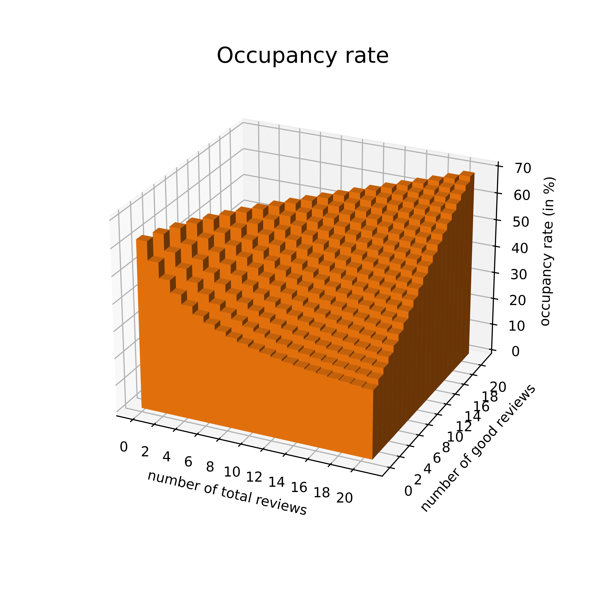

# Replication code

## Parameters
  
|  | name |            |  value |
  | ---: | ---: | :---------: | :------: |
  | demand (<code>theta</code>) | price | $\alpha$ | -0.0068 |
  || type 1 | $\beta_1$ | -10.5354 |
  || type 2 | $\beta_2$ | -9.8218 |
  || type 3 | $\beta_3$ | -9.4401 |
  || type 4 | $\beta_4$ | -8.9099 |
  || quality | $\gamma$ | 2.8607 |
  || prior | $a$ | 3.9902 |
  ||  | $b$ | 1.0690 |
  | supply (<code>c</code>) | mean entry cost (type 1) | $\bar \kappa_1$ | 181,368 |
  |  | mean entry cost (type 2) | $\bar \kappa_2$ | 264,819 |
  |  | mean entry cost (type 3) | $\bar \kappa_3$ | 426,997 |
  |  | mean entry cost (type 4) | $\bar \kappa_4$ | 796,930 |
  || mean fixed cost (type 1) | $\bar \phi_1$ | 2,323 |
  | | mean fixed cost (type 2) | $\bar \phi_2$ | 3,587 |
  || mean fixed cost (type 3) | $\bar \phi_3$ | 4,345 |
  || mean fixed cost (type 4) | $\bar \phi_4$ | 5,572 |
  | other (<code>params</code>) | discount factor | $\delta$ | 0.995 |
  |  | revenue fee | $f$ | 0.142 |
  |  | review prob. | $\upsilon_r$ | 0.992 |
  |  | max. no. of reviews | $\bar N$ | 20 |
  |  | arrival rate | $\mu$ | 10,000 |
  |  | max. no. of listings | $J$ | 10,000 |

## Demand

Function <code>U_s(p,theta,t,params)</code> characterizes a guests's indirect **utility** of renting a property in state $x=(N,K,j)$, where $j = 1,2,3,4$ is the property's (observed) **type**.

  $$U_x = \gamma\frac{a + K(x)}{a + b + N(x)} + \beta(x) + \alpha ((1+f)p- t) + \epsilon = u(p,x) + \epsilon$$
  
* $p$ is the daily rental rate of the listing; $t$ is the counterfactual per-unit subsidy (if t>0) or tax (if t<0). For the moment, we set $t$ equal to zero.

* The **unobserved quality** $\omega$ is unknown to guests and hosts. However, $\omega$ is known to be iid $Beta(a,b)$ distributed. After observing the number of good reviews $K$ and bad reviews $N-K$ agents form an expectation about the unobserved quality, $E[\omega|N,K] = \frac{a + K}{a + b + N}$.</li>

* $\epsilon$ is iid T1EV extreme value distributed.

$\mathbf{s}$ is the **state distribution**. $s(x)$ pins down the number of properties in each state. Function <code>ccp_s(p,P,s,theta,t,params)</code> characterizes the probability that a guest ***intends*** to book the property at rate $p$ provided that all remaining hosts set their prices according to $P(x)$.

$$ccp(p,x) = \frac{\exp(u(p,x))}{1+\sum_xs(x)\exp(u(P(x),x))}$$ 

For later use, we also work out the first-order (<code>dccp_s(p,P,s,theta,t,params)</code>) and second-order (<code>d2ccp_s(p,P,s,theta,t,params)</code>) derivatives of $ccp(p,x)$ with respect to $p$.

$$ccp'(p,x) = ccp(p,x)(1 - ccp(p,x))\alpha(1+f) $$

$$ccp''(p,x) = ccp(p,x)(ccp(p,x)^2 - ccp(p,x))\alpha^2(1+f)^2 $$

The number of arriving guests is $Poisson(\mu)$ distributed. Function <code>q_s(p,P,s,theta,t,params)</code> characterizes the probability that at least one of these consumers books the property, again assuming its rental rate is $p$ while everyone else follows the pricing rule $P(x)$.

$$q(p,x) = 1 - \exp(-\mu \cdot ccp(p,x))$$

Function <code>dq_s(p,P,s,theta,t,params)</code> and function <code>d2q_s(p,P,s,theta,t,params)</code> describe the first- and second-order derivatives of $q(p,x)$ with respect to $p$.

  $$q'(p,x) = \mu\exp(-\mu \cdot ccp(p,x))ccp'(p,x)$$
  
  $$q''(p,x) = \mu\exp(-\mu \cdot ccp(p,x))(ccp''(p,x)-\mu\cdot ccp'(p,x))$$

$q_s$ is the ***daily*** booking probability. In the aggregated data and in the model, where a **time period** is defined as a 4-week interval ("month"), $q_s$ is going to reflect the monthly **occupancy rate**. 

## State Transitions

If a property is fully booked in a given month ($q(p,x) = 1$), a listing adds $\upsilon_r = 0.992$ reviews between periods and $x$ changes. Conditional on being booked, it receives a good review ($\Delta N = 1, \Delta K = 1$) with probability $\frac{a+K(x)}{a+b+N(x)}$. Conditional on being booked, it receives a bad review ($\Delta N = 1, \Delta K = 0$) with probability $\left(1-\frac{a + K(x)}{a+b+N(x)}\right)$. The **probability of getting a good review**  and the **probability of getting a bad review** are $\rho^g(p,x)$ and $\rho^b(p,x)$ respectively. States where $N=20$ are **terminal** and the probability of getting a review is zero.

$$\rho^g(p,x) = \upsilon_rq(p,x)\frac{a+K(x)}{a+b+N(x)}$$

$$\rho^b(p,x) = \upsilon_rq(p,x)\left(1-\frac{a + K(x)}{a+b+N(x)}\right)$$

Accordingly, the probability $\rho^0(p,x)$ of getting no review is $1-\rho^g(p,x)-\rho^b(p,x)$. States are arranged in increasing order of type $j$ and, for a given type, in increasing order of $N$ and, for a given $N$, in increasing order of $K$. $S$ is the **state space**. Note: $S$ is in <code>params</code>.

$$ S = \begin{bmatrix} 
0 & 0 & 1 & 0 & 0 & 0 \\ 
0 & 1 & 1 & 0 & 0 & 0 \\
1 & 1 & 1 & 0 & 0 & 0 \\
0 & 2 & 1 & 0 & 0 & 0 \\
1 & 2 & 1 & 0 & 0 & 0 \\
2 & 2 & 1 & 0 & 0 & 0 \\
... & ... & ... & ... & ... & ... \\ 
11 & 17 & 0 & 0 & 1 & 0 \\
12 & 17 & 0 & 0 & 1 & 0 \\
13 & 17 & 0 & 0 & 1 & 0 \\
... & ... & ... & ... & ... & ... \\ 
19 & 20 & 0 & 0 & 0 & 1 \\
20 & 20 & 0 & 0 & 0 & 1
\end{bmatrix} $$

Function  <code>dT_s(dq,theta,params)</code> stores the **transition matrix** $\mathbf{T}(p)$. It turns out that the way states are ordered the number of zeros between $\rho^0(p,x)$ and $\rho^g(p,x)$ is $N$.  

|  | $(0,0,1)$ | $(0,1,1)$ | $(1,1,1)$ | $(0,2,1)$ | $(1,2,1)$ | $(2,2,1)$ | ... | $(20,20,4)$ | 
| :---: | :---: | :---------: | :------: | :------: | :------: | :------: | :------: | :------: |
| $(0,0,1)$ | $\rho^0_{(0,0,1)}$ | $\rho^b_{(0,0,1)}$ | $\rho^g_{(0,0,1)}$ | 0 | 0 | 0 | ... | 0 |
| $(0,1,1)$ | 0 | $\rho^0_{(0,1,1)}$ | 0 | $\rho^b_{(0,1,1)}$ | $\rho^g_{(0,1,1)}$ | 0 | ... | 0 |
| $(1,1,1)$ | 0 | 0 | $\rho^0_{(1,1,1)}$ | 0 | $\rho^b_{(1,1,1)}$ | $\rho^g_{(1,1,1)}$ | ... | 0 |
| $(0,2,1)$ | 0 | 0 | 0 | $\rho^0_{(0,2,1)}$ | 0 | 0 | ... | 0 |
| $(1,2,1)$ | 0 | 0 | 0 | 0 | $\rho^0_{(1,2,1)}$ | 0 | ... | 0 |
| $(2,2,1)$ | 0 | 0 | 0 | 0 | 0 | $\rho^0_{(2,2,1)}$ | ... | 0 |
| ... | ... | ... | ... | ... | ... | ... | ... | 0 |
| $(20,20,4)$ | 0 | 0 | 0 | 0 | 0 | 0 | ... | 1 |

Function <code>dT_s(q,theta,params)</code> and <code>d2T_s(q,theta,params)</code> store the first-order and second-order derivatives of $\mathbf{T}(p)$ respectively. Notice:

$$\rho^{0\prime}(p,x) = -\upsilon_rq'(p,x)$$

$$\rho^{0\prime\prime}(p,x) = -\upsilon_rq''(p,x)$$

$$\rho^{g\prime}(p,x) = \upsilon_rq'(p,x)\left(\frac{a+K(x)}{a+b+N(x)}\right)$$

$$\rho^{g\prime\prime}(p,x) = \upsilon_rq''(p,x)\left(\frac{a+K(x)}{a+b+N(x)}\right)$$

$$\rho^{b\prime}(p,x) = \upsilon_rq'(p,x)\left(1-\frac{a+K(x)}{a+b+N(x)}\right)$$

$$\rho^{b\prime\prime}(p,x) = \upsilon_rq''(p,x)\left(1-\frac{a+K(x)}{a+b+N(x)}\right)$$

## Market Entry & Exit

Types are equally distributed in the host population, meaning 2,500 properties have a certain type. If a host is **inactive** and has not yet entered the market, they can do so at the start of the following month at **entry cost** $\kappa_j$ which is iid drawn from $Exponential(\bar \kappa_j)$, $j=1,2,3,4$. Let $\lambda_j$ denote the **entry rate**. 

$$ \lambda_j = 1-\exp(-\delta V((0,0,j))]\bar\kappa_j^{-1} ) $$

Denote the number of properties of type $j$ by $s_j$. The expected, total entry costs of type $j$ hosts in a given month is the number of inactive hosts $(J/4 - s_j)$ times $\mathbb{E}[\kappa_j|\phi_j\geq \delta V(0,0,j)]\lambda_j$.

$$ \text{Total entry costs} = \sum_{j}\left(J/4 - \sum_xs_j(x)\right)\left(\lambda_j\bar \kappa_j - (1-\lambda_j)\delta V((0,0,j))\right) $$

If a host is **active** they have entered the market. At the end of each month they have to pay the **operating cost** $\phi_j$ for the following month, regardless of whether the property is booked or not. $\phi_j$ is iid $Exponential(\bar \phi_j)$ distributed. Let $\chi(p,x)$ denote the **exit rate**.

$$ \chi(p,x) = \exp(-\delta \mathbb{E}_{\tilde x}[V(\tilde x)|p,x]\bar\phi_j^{-1} ). $$

$\tilde x$ denotes the state in the next month. Note that the host's expectation depends on $p$ because the property is likely to transition to a new state if it is booked.  

The expected, total operating costs of properties in a certain state in a given month are the number of active hosts $s(x)$ times $\mathbb{E}[\phi(x)|\phi(x)\leq \delta \mathbb{E}_{\tilde x}[V(\tilde x)|p,x]]\chi(x)$ 

$$ \text{Total operating costs} = \sum_{x}s(x)\left((1-\chi(p,x))\bar \phi(x) - \chi(p,x)\delta \mathbb{E}_{\tilde x}[V(\tilde x)|p,x]\right) $$ 

<code>F_s(p,P,s,q,chi,lamb,theta,t,params)</code> contains the **expanded transition matrix** $\mathbf{F}(p)$. It accommodate transitions from and to inactivity by expanding $\mathbf{T}(p)$ by an additional state. Let $\nu^i_x = (1-\chi_s)\rho^i$, $i=g,b,0$ be the transition probability accounting for exit.

|  | $(0,0,1)$ | $(0,1,1)$ | $(1,1,1)$ | $(0,2,1)$ | $(1,2,1)$ | $(2,2,1)$ | ... | $(0,0,2)$ | ... | $(20,20,4)$ | $(20,20,4)$ |  
| :---: | :---: | :---------: | :------: | :------: | :------: | :------: | :------: | :------: | :------: | :------: | :------: |
| $(0,0,1)$ | $\nu^0_{(0,0,1)}$ | $(\nu^b_{(0,0,1)}$ | $\nu^g_{(0,0,1)}$ | 0 | 0 | 0 | ... | ... | ... | 0 | $\chi_{(0,0,1)}$ |
| $(0,1,1)$ | 0 | $\nu^0_{(0,1,1)}$ | 0 | $\nu^b_{(0,0,1)}$ | $\nu^g_{(0,0,1)}$ | 0 | ... | ... | ... | 0 | $\chi_{(0,1,1)}$ |
| $(1,1,1)$ | 0 | 0 | $\nu^0_{(1,1,1)}$ | 0 | $\nu^b_{(1,1,1)}$ | $\nu^g_{(1,1,1)}$ | ... | ... | ... | 0 | $\chi_{(1,1,1)}$ |
| $(0,2,1)$ | 0 | 0 | 0 | $\nu^0_{(0,2,1)}$ | 0 | 0 | ... | ... | ... | 0 | $\chi_{(0,2,1)}$ |
| $(1,2,1)$ | 0 | 0 | 0 | 0 | $\nu^0_{(1,2,1)}$ | 0 | ... | ... | ... | 0 | $\chi_{(1,2,1)}$ |
| $(2,2,1)$ | 0 | 0 | 0 | 0 | 0 | $\nu^0_{(2,2,1)}$ | ... | ... | ... | 0 | $\chi_{(2,2,1)}$ |
| ... | ... | ... | ... | ... | ... | ... | ... | ... | ... | ... | ... |
| $(0,0,2)$ | 0 | 0 | 0 | 0 | 0 | 0 | ... | $\nu^0_{(0,0,2)}$ | ... | 0 | $\chi_{(0,0,2)}$ |
| ... | ... | ... | ... | ... | ... | ... | ... | ... | ... | ... | ... |
| $(20,20,4)$ | 0 | 0 | 0 | 0 | 0 | 0 | ... | ... | ... | $1 - \chi_{(20,20,4)}$ | $\chi_{(20,20,4)}$ |
| $\varnothing_1$ | $\lambda_1$ | 0 | 0 | 0 | 0 | 0 | ... | ... | ... | 0 | $1-\lambda_1$ |
| $\varnothing_2$ | 0 | 0 | 0 | 0 | 0 | 0 | ... | $\lambda_2$ | ... | 0 | $1-\lambda_2$ |
| $\varnothing_3$ | 0 | 0 | 0 | 0 | 0 | 0 | ... | ... | ... | 0 | $1-\lambda_3$ |
| $\varnothing_4$ | 0 | 0 | 0 | 0 | 0 | 0 | ... | ... | ... | 0 | $1-\lambda_4$ |

## Solving The Model

<code>solver(theta,c,guess,t,tol,params)</code> finds an oblivious equilibrium of the model. <code>guess</code> contains starting values for the prices $\mathbf{\hat P}$, the state distribution $\mathbf{\hat s}$ and the value function $\mathbf{\hat V}$.

  ### Price Update

Conditional on guess $\mathbf{\hat V}$ and assuming that there are $\hat s(x)$ competitors in state $x$ who set their prices according to $\hat P(x)$, a host operating a property in state $x$ maximizes $V(x)$ over $p$.

$$ V(p,x) = 28q(p,x)p - (1-\chi(p,x))\phi(x) + \delta \mathbf{T}\mathbf{\hat V} $$

The FOC requires that $V'(p,x) = 0$. The first-order Taylor series approximation around $p_0$ is $V'(p,x) = V'(p_0,x) + V''(p_0,x)(p-p_0)$. We find $p$ by iterating 

$$p = p_0 - \frac{V'(p_0,x)}{V''(p_0,x)}$$

until $|p-p_0| \leq 0.1$. 

<code>dV_s(p,P,s,V,theta,phi_bar,t,params)</code> and <code>d2V_s(p,P,s,V,theta,phi_bar,t,params)</code> store the first- and second-order derivative of $V(p,x)$ with respect to p respectively.

$$ V'(p,x) = 28(q(p,x) + q'(p,x)p) + (1 - \chi(p,x))\delta \mathbf{T}'(p)\mathbf{\hat V} $$

$$ V''(p,x) = 28(2q'(p,x) + q''(p,x)) + (1 - \chi(p,x))\delta \mathbf{T}''(p)\mathbf{\hat V} - \chi(p,x)\frac{(\delta \mathbf{T}(p)\mathbf{\hat V})^2}{\phi(x)} $$

In code:

<code>while dP>.1:
&nbsp;&nbsp;&nbsp;&nbsp;&nbsp;&nbsp; P1 = P0 - dV_s(P0,P_old,s_old,V_old,theta,phi_bar,t,params)/d2V_s(P0,P_old,s_old,V_old,theta,phi_bar,t,params)
&nbsp;&nbsp;&nbsp;&nbsp;&nbsp;&nbsp; P1 = np.where(np.isnan(P1) == True,P_old,np.where((P1<0),0,np.where((P1>1000),1000,P1)))
&nbsp;&nbsp;&nbsp;&nbsp;&nbsp;&nbsp; dP = np.max(np.abs(P1 - P0))
&nbsp;&nbsp;&nbsp;&nbsp;&nbsp;&nbsp; P0 = P1</code>

  ### Value Function Update

Having found $p$ that solves the host's pricing problem, we let $\mathbf{P}=p$ and update the value function.

$$ V(x) = 28q(P(x),x)P(x) - (1-\chi(P(x),x))\phi(x) + \delta \mathbf{T}(p)\mathbf{\hat V} $$

In code:

<code>q_new = q_s(P_new,P_new,s_old,theta,t,params)
T = T_s(P_new,P_new,s_old,q_new,theta,t,params)
eV = T @ V_old
V_new = 28 * (q_new * P_new.T) + delta * eV - (1 - np.exp(-delta * eV/phi_bar)) * phi_bar</code>

  ### Entry & Exit Rate Updates

We use $\mathbf{V}$ and $\mathbf{P}$ to compute $\lambda(x)$, $\chi(P(x),x)$ and, ultimately, $\mathbf{F}(P)$.

In code:

<code>eV = T @ V_new
chi = np.exp(-delta * eV/phi_bar).flatten()
lamb = (1-np.exp(-delta * V_new.reshape((231,4),order='F')[0,:]/[kappa1,kappa2,kappa3,kappa4]))
F = F_s(q_new,chi,lamb,theta,params)</code>

  ### State Distribution Update

We use $\mathbf{F}(P)$ to compute the **stationary state distribution**. Specifically, we iterate $\mathbf{s}$ until $|\mathbf{s} - \mathbf{s}_0|\leq 0.01$.

$$ \left[\mathbf{s},J/4-s_1,J/4-s_2,J/4-s_3,J/4-s_4\right] = \left[\mathbf{s}_0,J/4-s_1,J/4-s_2,J/4-s_3,J/4-s_4\right]\mathbf{F}(P) $$

In code:

<code>while np.max(np.abs(s_new - s_old))>1e-2:
&nbsp;&nbsp;&nbsp;&nbsp;&nbsp;&nbsp; s_old = s_new
&nbsp;&nbsp;&nbsp;&nbsp;&nbsp;&nbsp; s_new = (np.array([np.append(s_old,np.array([J/4-s_old[0,:231].sum(),J/4-s_old[0,231:462].sum(),J/4-s_old[0,462:693].sum(),J/4-
&nbsp;&nbsp;&nbsp;&nbsp;&nbsp;&nbsp; s_old[0,693:].sum()]))])@ F)[:1,:-4]</code>

  ### Solution

We update $\mathbf{\hat P} = \mathbf{P}$, $\mathbf{\hat s}=\mathbf{s}$ and $\mathbf{\hat V}=\mathbf{V}$ and repeat the algorithm until convergence, i.e., 

$$|\mathbf{P}-\mathbf{\hat P}|\leq \text{tol} \ \text{ and } \ |\mathbf{s}-\mathbf{\hat s}|\leq \text{tol} \ \text{ and } \ |\mathbf{V}-\mathbf{\hat V}|\leq \text{tol}.$$

<code>tol</code> is set to 0.000001. To save time, we solve the host's pricing problem only if $\mathbf{V}$ changes substantially, i.e., by more than 10\% since the last time we solved for $p$.

Our initial guess of $P(x)$ is \$200 for all $x$. The initial guess of the state distribution is that half of the properties are in the market, while half are not. Those that are in the market are uniformely distributed across states. The initial guess for the value function is the PDV of the revenue earned by the host if they as well as all competitors set a rental rate of \$200 a night.

In code:

<code>P_init = np.array([[200] * len(S)])
s_init = np.zeros((S.shape[0],1)).T
s_init[0,[0,231,462,693]] = [J/8,J/8,J/8,J/8]
V_init = (28 * q_s(200,P_init,s_init,theta,0,params) * P_init.T)/(1-delta)
s_star = np.where(s_star<0,0,s_star) 
</code>

The solution to the model is $\mathbf{V}^\ast, \mathbf{s}^\ast, \mathbf{P}^\ast, \mathbf{\chi}^\ast, \mathbf{\lambda}^\ast$. We use the solution to compute $q({P}^*(x),x)$.

In code:

<code>V_star,s_star,P_star,chi_star,lamb_star = solver(theta,c,[P_init,s_init,V_init],0,tol,params)
</code>

 | 

 | 

## Simulating Data

For this purpose of replicating our estimation results, we solve the model and simulate four years (52 months or 260 5-day long booking period) worth of data based on the model solution. For each booking period, we draw the equilibrium number of active listings from $\mathbf{s}^\ast$. For each booking period, each host sets the rental rate of their listing according to $\mathbf{P}^\ast$ plus some random, normally distributed shock. We then calculate the occupancy rate given the rental rates of all active listings. We aggregate the simulated data to the monthly level.    

Load the data using the following code:

<code>data = pd.read_pickle(os.path.join(Path().absolute().parent, 'data\\data.pkl'))</code>

## Demand Estimation

  ### Inversion

We estimate the demand parameters using GMM. <code>xi(omicron,adata,params)</code> stores the **structural error term** $\xi_{it}$ of property $i$ at time $t$.

$$\xi_{it}(\omicron) = \ln(ccp_{it}) - \ln(ccp_{0t}) - u_{it}(\omicron)$$

$ccp_{0t}$ is $1-\sum_i ccp_{it}$. We retrieve $ccp_{it}$ from the data by inverting $q_{it}$. 

$$ ccp_{it} = -\ln(1 - q_{it})/\mu $$

In code:

<code>data_est = data.copy()
data_est['share'] = -np.log(1 - data_est['q'])/mu
data_est = data_est[(data_est['share'] > 0) & (data_est['share'] < np.inf)]</code>

Notice that, order to arrive at the regression equation, we must take the logarithm *twice*. This introduces additional bias from measurement error and complicates the estimation. In code:

<code>data_est['share_0'] = 1 - data_est.groupby(['month'])['share'].transform('sum')
</code>

Rather than estimating $\theta = (a,b,\alpha,\boldsymbol{\beta},\gamma)$ directly, we estimate $\omicron = (\psi,\iota,\alpha,\boldsymbol{\beta},\gamma)$ to facilitate the estimation.

$$ \frac{a}{a+b} = \frac{1}{1+\exp(-\psi)} $$

$$ (a+b) = \exp(\iota) $$

  ### Objective Function

The **objective function** is stored in <code>O(omicron,adata,W,params)</code>. Let $I$ denote the total number of observations of the dataset.

$$\left(\frac{1}{I}\mathbf{Z}^T\boldsymbol{\xi}(\omicron)\right)^TW\left(\frac{1}{I}\mathbf{Z}^T\boldsymbol{\xi}(\omicron)\right)$$

$\mathbf{Z}$ is the set of **instruments**. Here, we simply use the rental rate $p$ , number of reviews $N$ and $K$ and the average rating $r=1+4(K/N)$ (note that in the mock data, rental rates and reviews are not endogenous). We infer a listing's rating from its state. In code: 

<code>data_est['r'] = 1 + 4*data_est['K']/data_est['N']
data_est = data_est[(data_est['r'] > 0)]
</code>

We minimize $O(\omicron)$ using the analytical gradient.

$$ \nabla O(\omicron) = 2\left(-\frac{1}{I}\mathbf{Z}^T\nabla u(\omicron)\right)^T W\left(\frac{1}{I}\mathbf{Z}^T\boldsymbol{\xi}(\omicron)\right) $$

<code>dO(omicron,adata,W,params)</code> contains $\boldsymbol{\xi}'(\omicron)$. It requires $\nabla u(\omicron)$ (<code>dU(omicron,adata,params)</code>).

  ### Minimization

To initiate the minimization, we choose appropriate starting values. For the first step of two-step GMM we set the weighting matrix equal to the inverse of the variance-covariance matrix of the instruments.

$$ W_1 = I\left(\mathbf{Z}^T\mathbf{Z}\right)^{-1} $$

In code:

<code>omicron0 = [0,0,0,-10,-10,-10,-10,0]
W1 = np.linalg.inv( ((Z(omicron0,data,params)).T @ (Z(omicron0,data,params)))/len(data))
res_demand = minimize(O, omicron0, args=(data,W1,params), method='BFGS',jac=dO)</code>

In the second step, we choose the efficient weighting matrix. Let $\hat \omicron$ be our estimation result from the first stage.

$$ W_2 = \left(\left(-\frac{1}{I}\mathbf{Z}^T\boldsymbol{\xi}(\widehat \omicron)\right)\left(-\frac{1}{I}\mathbf{Z}^T\boldsymbol{\xi}(\widehat \omicron)\right)^T\right)^{-1} $$

In code:

<code>xi_hat = xi(res_demand.x,data,params)
W2 = np.linalg.inv( ((xi_hat * Z(res_demand.x,data,params)).T @ (xi_hat * Z(res_demand.x,data,params)))/len(data) )
res_demand = minimize(O, omicron0, args=(data,W2,params), method='BFGS',jac=dO)
</code>

  ### Standard Errors

As we have chosen the efficient weighting matrix in the second step, the (heteroscedasticity robust) **standard errors** simplify to

$$ \frac{1}{I}\left( diag\left( \left( \left(\frac{1}{I}\mathbf{Z}^T\nabla u(\hat \omicron)\right)^TW_2\left(\frac{1}{I}\mathbf{Z}^T\nabla u(\hat \omicron)\right) \right)^{-1} \right) \right)^\frac{1}{2} $$

In code:

<code>G_bar = ( (Z(res_demand.x,data,params).T @ (-dU(res_demand.x,data,params))) )/len(data)
W2 = np.linalg.inv( ((xi_hat * Z(res_demand.x,data,params)).T @ (xi_hat * Z(res_demand.x,data,params)))/len(data) )
S_hat = np.diag(np.linalg.inv((G_bar.T @ W2) @ G_bar))**.5/len(data)
</code>

  ### Estimation Results

| parameter | estimate | standard error |
| ---: | :---------: | :------: |
  | $\phi$ | 1.2484 | (0.0781) |
  | $\iota$ | 1.5033 | (0.0900) |
  | $\alpha$ | -0.0062| (0.0002) |
  | $\beta_1$ | -10.2595 | (0.1026) |
  | $\beta_2$ | -9.7222 | (0.1023) |
  | $\beta_3$ | -9.4432 | (0.1026) |
  | $\beta_4$ | -9.0730 | (0.1033) |
  | $\gamma$ | 2.0097 | (0.1155) |

We convert $\hat \omicron$ to $\hat \theta$. In code:

<code>theta_hat = [expit(res_demand.x[0])*np.exp(res_demand.x[1]),
(1-expit(res_demand.x[0]))*np.exp(res_demand.x[1]),
res_demand.x[2],
res_demand.x[3:7],
res_demand.x[7]]</code>

Our estimates of $\psi$ and $\iota$ correspond to $a=12.3102$ and $b=1.8890$. Notice that our estimates are slightly biased as the demand inversion is non-linear and the measurement error is not fully captured by the structural error term.

## Supply Estimation

  ### Objective Function

We estimate $\mathbf{c} = (\phi_1,\phi_2\phi_3,\phi_4,\kappa_1,\kappa_2,\kappa_3,\kappa_4)$ by maximizing the logarithm of the likelihood of the equilibrium state distribution $\mathbf{s}$ over $\mathbf{c}$. This requires that we infer the average number of listings $\mathbf{s}^d$ from the (mock) data.

In code:

<code>s_d = np.array([(data.groupby(['x'])['period'].count()/data.groupby(['period']).mean().shape[0]).reindex(np.arange(0,len(S)), fill_value=0)])</code>

<code>likelihood(k,theta,tol,s_d,params)</code> stores the **log-likelihood** function (times -1). 

$$ \text{Log-likelihood} = \sum_{x} s^d(x) \ln \left(s^\ast(x|\mathbf{c}) \right) + \sum_j\left(\frac{J}{4}-\sum_{x}s_j^d(x)\right)\ln\left(\frac{J}{4}-\sum_{x}s_j^\ast(x|\mathbf{c})\right) $$
    
We exclude states for which we do not observe any observations in the mock data. We also exclude states for which the model predicts that there are no observations as otherwise the log-likelihood is undefined.

  ### Maximization

<code>tol</code> is set to 1. Each candidate for $\mathbf{c}$ requires us to solve the model. We use the same <code>guess</code> as in the 'Solving the Model' section to initiate the solution algorithm. After that, we use the model solution for the previous set of candidates as the starting values to find the model solution for the next set of candidates. Furthermore, we use the demand estimates $\hat \theta$. To facilitate the search of a maximum, we search over $\ln(\mathbf{c})$, thereby excluding negative values. <code>k0</code> contains the starting values.

In code:

<code>k0 = np.log([100000,100000,100000,100000,3000,3000,3000,3000])
res_supply = minimize(likelihood, k0, args=(theta_hat,tol,s_d,params), method='Nelder-Mead')
c_hat = np.exp(res_supply.x)
</code>

  ### Standard Errors

We compute the $\text{Information}(\mathbf{\hat c})$ as $\sum_{j,t}Score_{jt}(\mathbf{\hat c})Score_{jt}(\mathbf{\hat c})^T$. We numerically approximate $Score_{jt}$ as follows.

$$ Score_{jt}(\mathbf{\hat c}) = \frac{1}{s^\ast(x_{jt}|\mathbf{c})}\frac{\partial s^\ast(x_{jt}|\mathbf{\hat c})}{\partial \mathbf{\hat c}}, $$

where

$$ \frac{\partial s^\ast(x|\mathbf{\hat c})}{\partial \hat c_k} = \frac{s^\ast(x|\mathbf{\hat c} + \boldsymbol{\epsilon}_k)-s^\ast(x|\mathbf{\hat c})}{\boldsymbol{\epsilon}_k}, $$

$\hat c_k$ being the kth element in $\mathbf{\hat c}$ and $\boldsymbol{\epsilon}_k$ containing $\epsilon$ at the kth position and zeros otherwise.

Function <code>approx_score(k,epsilon,theta,guess,tol,params)</code> carries out the numerical approximation for each state. Using the delta method, the standard error of $\mathbf{\hat c}$ are then calculated as follows.

$$ \sqrt{\left(\frac{\partial f(\mathbf{c})}{\partial \mathbf{c}}\right)\frac{diag\left((\text{Information}(\mathbf{\hat c}))^{-1}\right)}{I}\left(\frac{\partial f(\mathbf{c})}{\partial \mathbf{c}}\right)^T} $$

In code:

<code>scores = scores_x[:,np.hstack((np.array(data['x']))).astype(int)]
((c_hat * np.diag(np.linalg.inv(scores @ scores.T))) * c_hat)**0.5
</code>

  ### Estimation Results

  | parameter | estimate | standard error |
| ---: | :---------: | :------: |
  | $\bar \kappa_1$ | 247,359 | (4,097.0096) |
  | $\bar \kappa_2$ | 297,059 | (4,699.9060) |
  | $\bar \kappa_3$ | 445,635 | (7,776.0871) |
  | $\bar \kappa_4$ | 783,870 | (10,474.4094) |
  | $\bar \phi_1$ | 2,273 | (0.7120) |
  | $\bar \phi_2$ | 3,330 | (0.9916) |
  | $\bar \phi_3$ | 3,961 | (1.6531) |
  | $\bar \phi_4$ | 4,951 | (2.1983) |
 
## Counterfactual Analysis

To calculate the counterfactual welfare change, we first solve for the status-quo model equilibrium, using the demand and supply estimates.

In code:
<code>V_star,s_star,P_star,chi_star,lamb_star = solver(theta_hat,c_hat,[P_init,s_init,V_init],0,tol,params)
</code>

We calculate the welfare change as $\Delta \text{Welfare} = \Delta (\text{consumer surplus}) +  \Delta (\text{producer surplus})$. Per-period consumer surplus is calculated as follows.

$$ 28\left(\mu - \sum_x^X s(x)(-\ln(1-q_s(x))-q_s(x))\right)\ln\left(1 + \sum_x^X s(x)u(P(x),x)\right) + \text{constant} $$

Per-period producer surplus is 

$$ \sum_x^Xs(x) 28q_s(x)(1+f)(P(x) - t) - \text{total operating costs} - \text{total entry costs}. $$

Note that, for our purposes here, we assume that hosts bear the cost of the policy. Based on the status-quo model solution we calculate current consumer surplus, producer surplus, and welfare (up to a constant). In code:

<code>q_star = q_s(P_star,P_star,s_star,theta_hat,0,params)    
T_star = T_s(q_star,theta_hat,params)
lamb0_star = np.array([np.repeat(lamb_star,231)]).T
chi0_star = np.array([chi_star]).T
eV0_in = T_star @ V_star
eV0_out = V_star.reshape((231,4),order='F')[0,:]
ps01_out = -(J/4-s_star[0,:231].sum()) * (c_hat[0] - (1-lamb0_star[0]) * (delta * eV0_out[0] + c_hat[0]))
ps02_out = -(J/4-s_star[0,231:462].sum()) * (c_hat[1] - (1-lamb0_star[231]) * (delta * eV0_out[1] + c_hat[1]))
ps03_out = -(J/4-s_star[0,462:693].sum()) * (c_hat[2] - (1-lamb0_star[462]) * (delta * eV0_out[2] + c_hat[2]))
ps04_out = -(J/4-s_star[0,693:].sum()) * (c_hat[3] - (1-lamb0_star[693]) * (delta * eV0_out[3] + c_hat[3]))
ps0_in = (s_star.T * ( 28 * q_star * (1+f) * P_star.T - (np.array([np.repeat(c_hat[4:],231)]).T - chi0_star * (delta*eV0_in + np.array([np.repeat(c_hat[4:],231)]).T)) ) ).sum()
cs0 = -( mu - s_star @ ( mu * ccp_s(P_star,P_star,s_star,theta_hat,0,params) - q_star ) ) * 28 * np.log(1 + (s_star @ np.array([np.diagonal(np.exp(U(P_star,theta_hat,0,params)))]).T) )/theta_hat[2]
ps0 = ps0_in + ps01_out + ps02_out + ps03_out + ps04_out
</code>

<code>welfare(t,theta,c,B,sol,tol,params)</code> calculates the welfare change if guests receive $\$ t_E$ upon booking an unreviewed ``entrant" listing and $\$ t_I$ upon booking an ``incumbent" listing with 20 reviews. As part of the function, <code>counterfactual(theta,c,guess,t_I,tol,params)</code> solves the the model for a given $t_E$, under the constraint that $t_I$ is such that the **average tax/subsidy is zero**. In code,

<code>t_I = -s_old[0,[0,231,462,693]].sum()*t_E/(s_old[0,210:231].sum()+s_old[0,441:462].sum()+s_old[0,672:693].sum()+s_old[0,903:924].sum())
        t = np.ones((S.shape[0],1))*t_I
        t[[0,231,462,693],:] = np.array([t_E]).T</code>

As a second constraint on the model solution, we impose that hosts make the same revenue as in the status-quo equilibrium such that

$$ V_new = 28 * q_s(P_star,P_star,s_star,theta,0,params) * P_star.T + delta * eV - (1 - np.exp(-delta * eV/phi_bar)) * phi_bar. $$

<code>welfare(t,theta,c,B,sol,tol,params)</code> searches over $t_E$, defined on the real numbers, to maximize the welfare increase. In code:

<code>WMax_t_l = minimize(welfare, 0, args=(theta_hat,c_hat,[cs0,ps0],[P_star,s_star,V_star],tol,params), method='Nelder-Mead')</code>

* An entrant subsidy of \72, implying an incumbent tax of \$55, is optimal.
* Consumer surplus increases by \$76k. Producer surplus decreases by \$30k (recall that this includes the cost of the policy).
* Accordingly, welfare increases by \$46k.
* There are 24 more active listings in the counterfactual equilibrium.  
